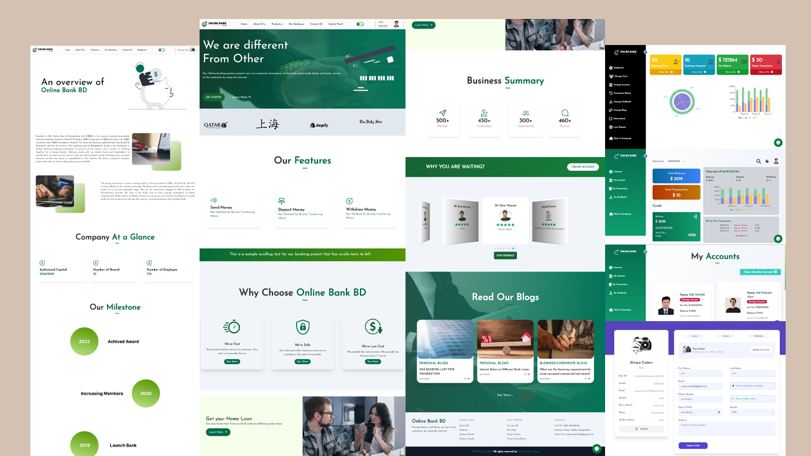

# Responsive Banking Website using ReactJS & Tailwind CSS.
# Online Bank Bd

Live Site [Online Bank BD](https://online-money-bd.netlify.app/).

## Below is the list of features we have implement in this project-

* _Google Authentication_
* _Signin & Signup_
* _Users Profile_
* _Create a Bank Account using Multi Step Form_
* _Live Image Capture_
* _User Dashboard_
* _Account Overview_
* _Deposit Money_
* _Withdraw Money_
* _Transfer Money_
* _Money Deposit With Card (Stripe)_
* _Bank Loan_
* _Transaction History_
* _Users Feedback_
* _Account Holder Notice_
* _Blog Page With Real Time Comment_
* _Real Time Chat_
* _Support Meeting_
* _Admin Panel_
* _Manage Users_
* _Manage Account_
* _Manage Feedbacks_
* _Manage Blogs_
* _Loan Approval_
* _Account Approval_
* _Manage Transactions_
* _All Transaction Email Service_
* _New User Verify Email System_

## Below is the list of NPM Packages we have used in this project-

* _React_
* _React Router Dom_
* _React Hook Form_
* _Email JS_
* _axios_
* _DaisyUI_
* _Flowbite_
* _framer-motion_
* _react-animated-slider_
* _react-countup_
* _react-loader-spinner_
* _react-reveal_
* _react-router-hash-link_
* _react-slick_
* _react-toastify_
* _react-webcam_
* _recharts_
* _redux_
* _slick-carousel_
* _sweetalert2_
* _tw-elements_
* _Swiper JS_
* _Font Awesome Icons_
* _Firebase_
* _material-tailwind_
* _aos animation library_
* _React Firebase Hooks_
* _tanstack/react-query_
* _iconscout/react-unicons_
* _reduxjs/toolkit_
* _stripe/react-stripe-js_
* _testing-library/jest-dom_

